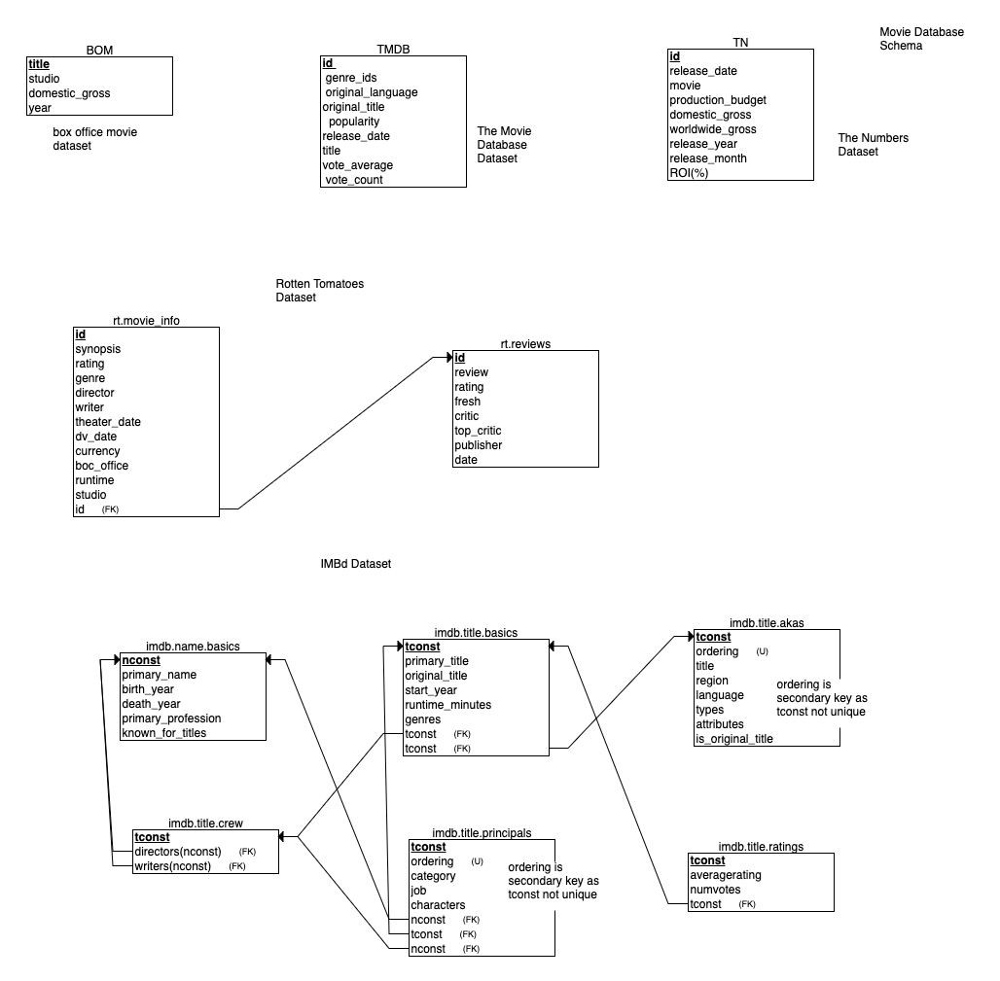

# 21st Century Movie Trend Analysis

**Author**: [Dylan Dey](mailto:ddey2985@gmail.com)

## Repository Structure 
```
├── data (raw zipped data and cleaned/processed data saved in seperate files)
├── images (png files for all images related to this project)
├── README.md (This ReadMe focuses heavily on the contents of the project)
├── Dataset_Tables.md  (table created to explore the contents of the data)
└── Data_Exploration_and_Processing.ipynb (first notebook for important and processing unkown data)
├── Analysis_and_Visualizations.ipynb (second notebook for visualizing the data and results)
└── moviePresentation.pd (final presentation of findings)
```

## Overview

This notebook imports the processed data from the Data Exploration notebook in order to analyze current movie trends on behalf of Microsoft's new movie studio. By putting an emphasis on the median ROI% value of movie data from a number of movie database websites, as well as by creating a list of the most popular movies, evaluation of financial performance and the risk involved was evaluted and recommendations based on these findings were made. A focus on large budget movies with particular genre elements released at the appropriate time of the year will ensure the best chance of success at the box office for Microsoft.

## Business Problem
This project covers the following hypothetical:
Microsoft wants to create a new movie studio and decided to hire me to conduct data analysis to determine what films are currently performing the best at the box office. Using multiple datasets from a number of movie databases, expected returns and risk as well as expected cost and how to best utilize recourses can be determined through anaylsis. As the newcomer to a crowded realm, further analysis was conducted to ensure a well recieved debut movie and to set the standard for the quality of it's future films.

## Data

[The Numbers](https://www.the-numbers.com/) <br>
[Box Office Mojo](https://www.boxofficemojo.com/) <br>
[IMDb](https://www.imdb.com/) <br>
[Rotten Tomatoes](https://www.rottentomatoes.com/) <br>
[The Movie Database](https://www.themoviedb.org/)

The Numbers and Box Office Mojo websites provided all of the financial information (budgets and revenue) needed for analysis. IMDb provids a large amount of data for writers, directors, genres, and general information for a large sum of movies. Rotten Tomatoes provides a unqiue value in terms of critical review from trained professionals. The Movie Database provides an alternative to the information available from IMDb. 

### Box Office Mojo Dataset 


This dataset contains box-office revenue (both domestic and foreign) and the year the movie was released by title and studio. The movies were released between the years 2010 and 2018 and the set contains thousands of entries.


The dataset contains the following fields:

**title:** Full title of the film. <br>
**studio:** Abbreviation of the film studio that produced the film. <br>
**domestic-gross:** The gross box-office revenue from North America (U.S., Canada, and Puerto Rico). <br>
**foreign_gross:** "The gross box-office revenue for the rest of the World. <br>
**year:** Year of film release.

### IMBd Dataset Initial Exploration


*imdb.name.basics.csv.gz*     

**nconst:** Unique identifier for names(of people, not movie titles)  <br>
**primary_name:** Full Name of person in movie industry <br> 
**birth_year:** year film industry person was born <br>
**death_year:** year of death <br>
**primary_profession:** Primary profession in the film industry <br>
**known_for_titles:** string of comma seperated *tconst* (unique title id of films for IMBd)<br>

 
*imdb.title.basics.csv.gz* 

**tconst:** Unique identifier for IMBd movie titles  <br>
**primary_title:** working title of movie <br> 
**original_title:** original title for movie release (untranslated) <br>
**start_year:** year of movie release <br>
**runtime_minutes:** float value of film length <br>
**genres:** string of comma seperated genre values<br>


*imdb.title.akas.csv.gz*   

**tconst:** Unique identifier for IMBd movie titles  <br>
**ordering:** indexes to go with each set of tconst <br> 
**title:** alt title specific to region <br>
**region:** region of particular title <br>
**language:** language of film (alot of missing data) <br>
**attributes:** descrpition of particular title (3D version, fake, etc)<br>
**is_original_title:** boolean check for OG title (0.0 false, 1.0 true)<br>


imdb.title.crew.csv.gz    

**tconst:** Unique identifier for IMBd movie titles  <br>
**directors:** comma seperated string of *nconst* for directors <br> 
**writers:** comma seperated string of *nconst* for writers<br>


*imdb.title.principals.csv.gz*   

**tconst:** Unique identifier for IMBd movie titles  <br>
**ordering:** indexes to go with each set of tconst <br> 
**nconst:** Unique identifier for names(of people, not movie titles) <br>
**category** job category (actor, director, writer, etc) <br>
**job:** role of particular nconst (person) <br>
**characters:** list of characters played by nconst for tconst <br>


*imdb.title.ratings.csv.gz*

**tconst:** Unique identifier for IMBd movie titles  <br>
**averagerating:** 1-10 IMBd movie score weighted average (see link below for detailed explanation of IMBd ratings) <br> 
**numvotes:** number of votes by registered users to calculate the IMBd score <br>

[IMDb weighted average for ratings](https://help.imdb.com/article/imdb/track-movies-tv/weighted-average-ratings/GWT2DSBYVT2F25SK?ref_=helpart_nav_8#)


### The Movie Database Initial Exploration

The Movie Database is an open alternative to IMDb with an easily accesible API. It is not as old as IMBd and therefore is less complete/established. 


**genre_ids:** list of Unique identifiers for TMDb genres <br>
**id:** unique id of movie title <br> 
**original_language:** abbrevated original language <br>
**original_title** string of original title <br>
**popularity:** score using various parameters to measure current popularity of title (see below for more info) <br>
**release_date:** date of movie release <br>
**title** working title of movie displayed on TMDb <br>
**vote_average:** average score 1-10 based on user votes <br>
**vote_count:** total number of votes for title rating <br>

[TMDb Popularity Explained](https://developers.themoviedb.org/3/getting-started/popularity)

### Rotten Tomatoes Dataset  Initial Exploration

*rt.movie_info.tsv.gz*

**id:** unique identifiers for RT titles <br> 
**synopsis:** summary of movie plot <br> 
**rating:** Motion Picture Association film rating system rating (R, PG, etc) <br>
**genre** list of genres <br>
**director:** string of directors <br>
**writer:** string of writers <br>
**theater_date** date movie hit theaters <br>
**dvd_release:** date movie available on DVD <br>
**currency:** currency of box_office revenue <br>
**box_office** gross domestic box office revenue  <br>
**runtime:** total runtime of film in minutes <br>

*rt.reviews.tsv.gz*

**id:** unqie title identifier, primary key <br>
**review:** crtic review (paragraph of text) <br> 
**fresh:** fresh or rotten (good or bad) score by critic <br>
**critic** name of critic  <br>
**top_critic:** booleon to check if critic is top critic for title <br>
**publisher:** publishing company critic works for <br>
**date:** date crtic published review <br>


*The data is described and explored in much more detail in the accompanying jupyter notebooks.*




## Methods

This project focuses on creating appropriate visualizations in order to quickly identify important trends for financial success of movies as well as approval from the public. An ROI% feature was engineered to gain financial insight, whereas a collection of popular movies was queried to make analyses focusing on IMDb ratings. 

## Results


Currently the trend for movie profitabilty is bit more varied than it was a decade ago, there still appears to be year over year growth and now is a good time for Microsoft to enter the field.

High budget films are preffered over low budget films in terms of financial success.

Early summer and winter holidays are the best times to release a new film.

Drama, Action, and Adventure are the most popular genre elements. 


## Conclusions
Overall, it is riskier to get into the movie studio buisness than it was at the beginning of the 2010s. That being said, there is still a good financial incentive for Microsoft to enter the field right now, keeping in mind the following recommendations: 

* Focus on large budget films and be prepared to spend more than $20,000,000 per film. Although lower budget movies can have impressive ROI returns, they are more likely to fail than larger budget movies. 
* Plan to release movies towards the beginning of summer, or during the winter holidays. Avoid releasing movies at the beginning of the year or during the fall. 
* Focus on creating a film with elements of Drama, Action, and Adventure as they tend to be recieved well by the public as compared to other genres. 


### Next steps


Include more consumer side analysis. Who is the major target audience? 

Gain more insight into lower budget movies and make further recommendations if high budget films are unnatainable. 

Including analysis of the rotten tomato dataset could reveal some insights about how critical acclaim affects the financial success of movies.

Including analysis of the TMDb Dataset with focus on the unique feature of 'popularity' can be used to support some of my findings and to explore the data even further.

By using the OMDb API, it would be possible to gain insight on how the success of a movie relates to their associated posters, but it was beyond the scope of this project.


## For More Information

See the full analysis in the [Exploratory Notebook](./Data_Exploration_and_Processing.ipynb) and [Analysis Notebook](./Analysis_and_Visualizations.ipynb) or review this [presentation](........).

For additional info, contact Dylan Dey at [ddey2985@gmail.com](mailto:ddey295@gmail.com)


## Repository Structure (reminder)

```
├── data
├── images
├── README.md
├── Dataset_Tables.md
└── Data_Exploration_and_Processing.ipynb
├── Analysis_and_Visualizations.ipynb
└── moviePresentation.pdf
```
